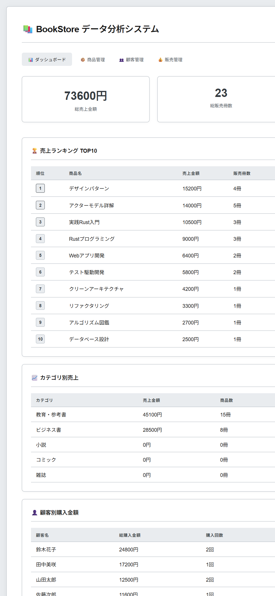
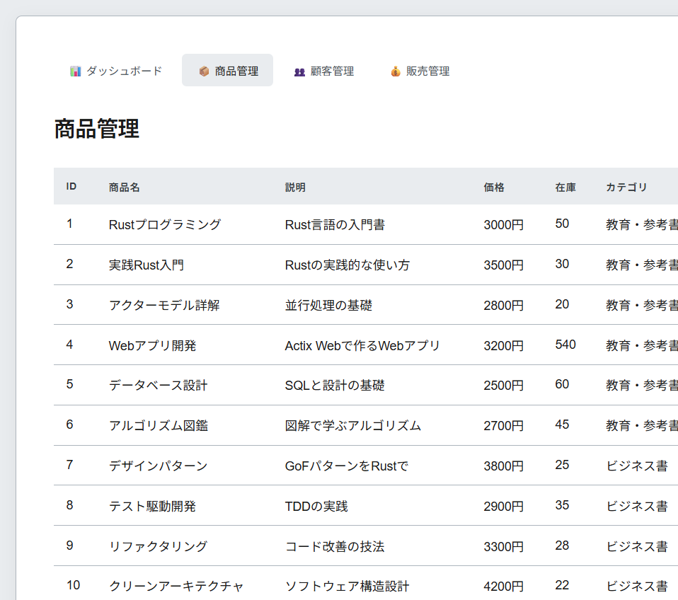
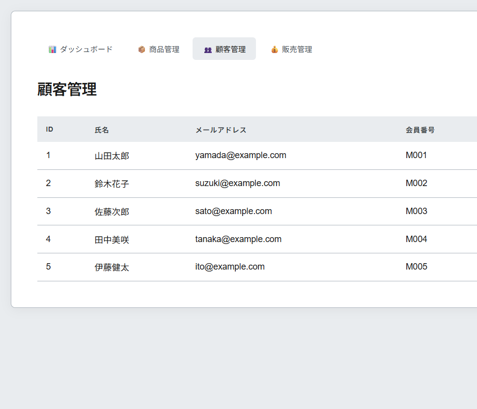
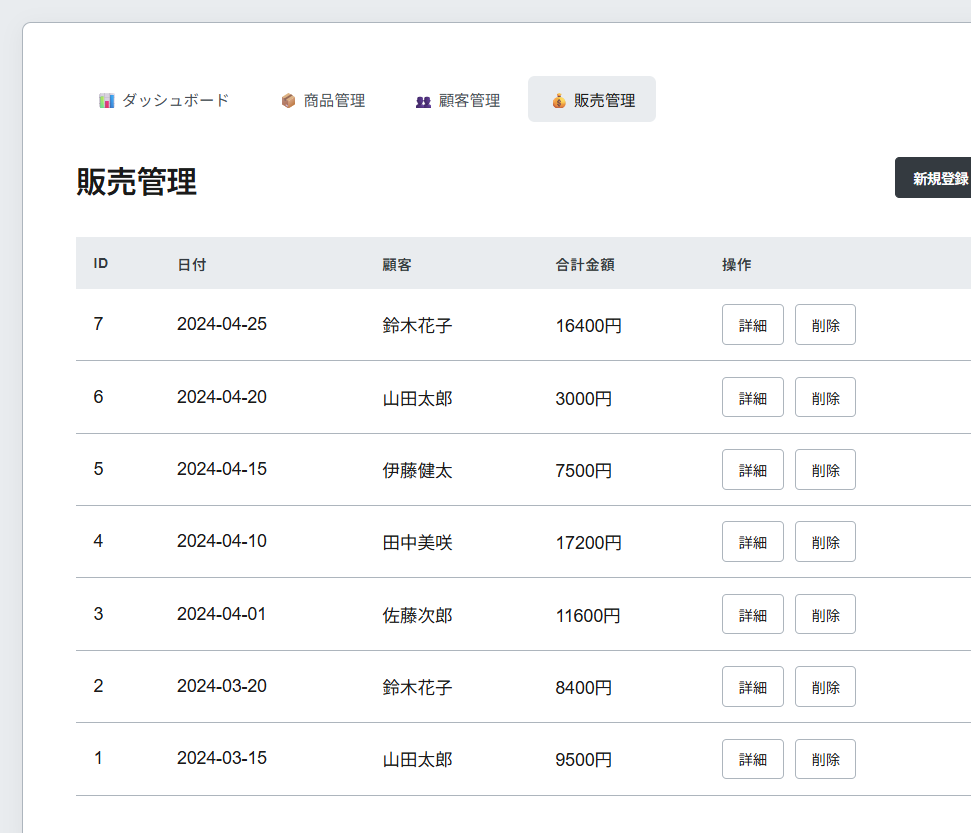
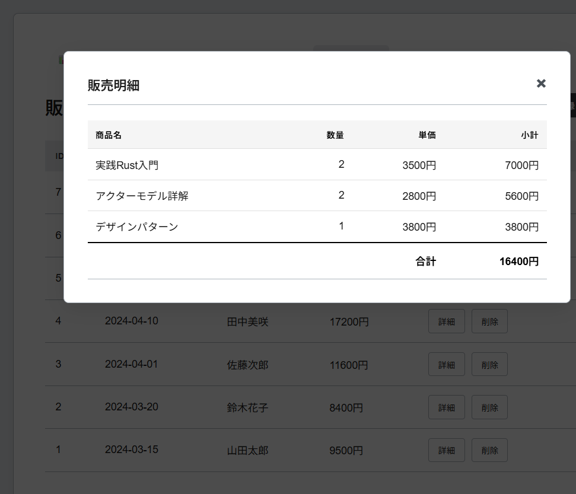
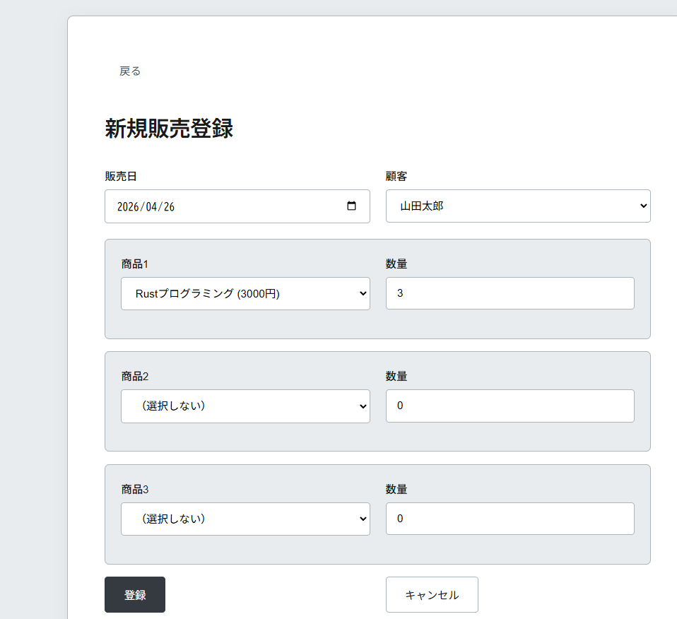

# BookStore - 商品販売データ分析システム (Rust版)

書籍店舗の商品販売データを収集・分析し、売上状況を可視化するWebアプリケーション。

## 目次

- [概要](#概要)
- [主な機能](#主な機能)
- [技術スタック](#技術スタック)
- [開発環境](#開発環境)
- [アーキテクチャ](#アーキテクチャ)
- [データベース設計](#データベース設計)
- [導入方法](#導入方法)
- [データ初期化](#データ初期化)
- [URL設計](#url設計)
- [APIレスポンス例](#apiレスポンス例)
- [デザイン](#デザイン)
- [画面キャプチャ](#画面キャプチャ)
- [開発者向け情報](#開発者向け情報)
- [実装の詳細](#実装の詳細)
- [セキュリティについて](#セキュリティについて)
- [ライセンス](#ライセンス)

## 概要

小売業の店舗管理者や販売データの分析担当者を対象とした、商品販売データの管理・分析システム。ダッシュボードでの売上可視化、商品・顧客管理、販売データの登録・閲覧機能を提供します。

## 主な機能

| 機能 | 説明 |
|------|------|
| 📊 **ダッシュボード** | 売上ランキング、カテゴリ別集計、顧客別分析を一括表示 |
| 📚 **商品管理** | 商品マスタの閲覧（在庫管理対応） |
| 👥 **顧客管理** | 顧客マスタの閲覧 |
| 💰 **販売管理** | 販売データの登録・閲覧（ヘッダーー明細構造） |

## 技術スタック

| 層 | 技術 | バージョン |
|----|------|-----------|
| 言語 | Rust | 1.91.1 |
| フレームワーク | Actix Web | 4.9 |
| 非同期ランタイム | Tokio | 1.x |
| DBドライバ | sqlx | 0.8 |
| データベース | SQLite | 3.x |
| テンプレートエンジン | Askama | 0.13 |
| ビルドツール | Cargo | 1.91.1 |
| シリアライズ | serde | 1.0 |

## 開発環境

**開発ツール:**
- **エディタ**: Trae (VS Code フォーク)
- **AIアシスタント**: Claude Code CLI + GLM 4.7
- **ツールチェーン**: GNU (x86_64-pc-windows-gnu) **【デフォルト】**
  - Git Bash でビルド可能
  - メインプロジェクトの開発に使用
  - MSVC は特殊な場合のみ使用

**開発プロセス:**
- Trae でのプロジェクト開発・デバッグ
- Claude Code CLI によるコード生成・レビュー・ドキュメント作成
- Git によるバージョン管理

## アーキテクチャ

### システム構成

```
┌─────────────────────────────────────────────────────────┐
│                      Browser                             │
│                   (Askama Templates)                     │
└────────────────────┬────────────────────────────────────┘
                     │ HTTP Request
                     ▼
┌─────────────────────────────────────────────────────────┐
│                    Handler Layer                        │
│  ┌──────────┐  ┌──────────┐  ┌──────────┐  ┌─────────┐ │
│  │   main   │  │ products │  │customers │  │  sales  │ │
│  │  index   │  │  _page  │  │  _page   │  │  _page  │ │
│  └──────────┘  └──────────┘  └──────────┘  └─────────┘ │
└────────────────────┬────────────────────────────────────┘
                     │
                     ▼
┌─────────────────────────────────────────────────────────┐
│                     Data Access                         │
│  ┌──────────┐  ┌──────────┐  ┌──────────┐  ┌─────────┐ │
│  │   sqlx   │  │  Query   │  │  Query   │  │  Query  │ │
│  │  Pool    │  │ Builder  │  │ Builder  │  │ Builder │ │
│  └──────────┘  └──────────┘  └──────────┘  └─────────┘ │
└────────────────────┬────────────────────────────────────┘
                     │ sqlx (async)
                     ▼
┌─────────────────────────────────────────────────────────┐
│                    SQLite Database                       │
└─────────────────────────────────────────────────────────┘
```

### プロジェクト構成

```
BookStore-Rust/
├── src/
│   ├── main.rs          # エントリーポイント、ハンドラー
│   ├── models.rs        # データモデル構造体
│   └── templates.rs     # Askama テンプレート構造体
├── templates/           # HTML テンプレート (Askama)
│   ├── index.html       # ダッシュボード
│   ├── products.html    # 商品一覧
│   ├── customers.html   # 顧客一覧
│   ├── sales.html       # 販売一覧
│   ├── sales-detail.html # 販売詳細 (Ajax用)
│   └── sales-create.html # 販売登録フォーム
├── migrations/
│   └── init.sql         # データベーススキーマ
├── docs/
│   ├── Rust手順書20260426.md  # 詳細な実装手順
│   ├── Steps/            # 各実装ステップのドキュメント
│   └── images/           # スクリーンショット
└── Cargo.toml          # 依存関係設定
```

### 各層の役割

#### Handler（ハンドラー層）
HTTPリクエストを受け取り、データベースアクセスとHTMLレンダリングを行います。

**役割:**
- HTTPリクエストの受信（GET/POST）
- パラメータの抽出とバリデーション
- データベースクエリの実行
- テンプレートへのデータ渡し
- HTMLの返却

```rust
// 例: 商品一覧ハンドラー
async fn products_page(pool: web::Data<SqlitePool>) -> Result<HttpResponse, actix_web::Error> {
    let products = sqlx::query_as::<_, models::Product>(
        "SELECT id, name, description, price, stock, published_date FROM products"
    )
    .fetch_all(pool.get_ref())
    .await?;

    let template = templates::ProductsTemplate { products };
    let html = template.render()?;
    
    Ok(HttpResponse::Ok().content_type("text/html; charset=utf-8").body(html))
}
```

#### Models（データモデル層）
データベースのテーブルに対応する構造体と、画面表示用のデータ構造を定義します。

**役割:**
- テーブル構造の定義（FromRowトレイト）
- データの保持
- JSONシリアライズ対応

```rust
#[derive(Debug, Serialize, FromRow)]
pub struct Product {
    pub id: i64,
    pub name: String,
    pub description: Option<String>,
    pub price: Option<i32>,
    pub stock: i32,
    pub published_date: Option<String>,
}
```

### なぜこの構造なのか？

#### 1. **シンプルさと型安全性**
Rustの型システムとsqlxのコンパイル時クエリチェックにより、型安全なデータアクセスが実現できます。

```
✓ コンパイル時にSQLの型安全性をチェック
✓ 実行時の型エラーを防止
✓ IDEによる補完が効く
```

#### 2. **非同期I/Oの性能**
Tokioランタイムによる非同期処理で、高い並行性を実現します。

```
✓ 非ブロッキングI/O
✓ 多数のリクエストを効率的に処理
✓ リソースを効率的に活用
```

#### 3. **保守性の向上**
機能追加や修正の際、影響範囲を限定できます。

```
例：集計ロジックの変更
→ 該当するハンドラーのみを修正すればOK
→ 他のハンドラは変更不要
```

#### 4. **テスト容易性**
各ハンドラーを独立してテストできます。

```
- ハンドラーのテスト：モックデータベースを使用可能
- モデルのテスト：単体テストが容易
```

## データベース設計

### ER図

```
┌─────────────┐
│  customers  │ 顧客マスタ
└──────┬──────┘
       │ 1:N
       ▼
┌─────────────┐
│sale_headers │ 販売ヘッダー
└──────┬──────┘
       │ 1:N
       ▼
┌─────────────┐
│    sales    │ 販売明細
└──────┬──────┘
       │ N:1
       ▼
┌─────────────┐           ┌─────────────┐
│  products   │ 商品マスタ │ categories  │ カテゴリマスタ
│             │    N:N    │             │
└─────────────┘──────────▶└─────────────┘
       ▲                           ▲
       │     ┌───────────────┐       │
       └────▶│product_categories│──────▶┘
             │   (中間テーブル)  │
             └──────────────────┘
```

### テーブル定義

#### customers（顧客マスタ）

| カラム名 | 型 | 説明 | 制約 |
|---------|---|------|------|
| id | INTEGER | 主キー | PRIMARY KEY, AUTOINCREMENT |
| name | TEXT | 氏名 | NOT NULL |
| email | TEXT | メールアドレス | UNIQUE |
| member_number | TEXT | 会員番号 | UNIQUE |

#### products（商品マスタ）

| カラム名 | 型 | 説明 | 制約 |
|---------|---|------|------|
| id | INTEGER | 主キー | PRIMARY KEY, AUTOINCREMENT |
| name | TEXT | 商品名 | NOT NULL |
| description | TEXT | 説明 | - |
| price | INTEGER | 価格 | - |
| stock | INTEGER | 在庫数 | DEFAULT 0 |
| published_date | TEXT | 発行日 | - |

#### categories（カテゴリマスタ）

| カラム名 | 型 | 説明 | 制約 |
|---------|---|------|------|
| id | INTEGER | 主キー | PRIMARY KEY, AUTOINCREMENT |
| name | TEXT | カテゴリ名 | NOT NULL, UNIQUE |

#### product_categories（商品-カテゴリ中間テーブル）

| カラム名 | 型 | 説明 | 制約 |
|---------|---|------|------|
| product_id | INTEGER | 商品ID | FOREIGN KEY → products(id), ON DELETE CASCADE |
| category_id | INTEGER | カテゴリID | FOREIGN KEY → categories(id), ON DELETE CASCADE |

**主キー:** `(product_id, category_id)` - 複合主キー

**役割:** 商品とカテゴリの多対多（N:N）関係を実現する中間テーブル

**データ例:**
```
| product_id | category_id |
|------------|-------------|
| 1          | 5           |  // Rustプログラミング → 教育・参考書
| 2          | 5           |  // 実践Rust入門 → 教育・参考書
| 7          | 2           |  // デザインパターン → ビジネス書
```

#### sale_headers（販売ヘッダー）

| カラム名 | 型 | 説明 | 制約 |
|---------|---|------|------|
| id | INTEGER | 主キー | PRIMARY KEY, AUTOINCREMENT |
| customer_id | INTEGER | 顧客ID | FOREIGN KEY → customers(id) |
| sale_date | TEXT | 販売日 | NOT NULL |

#### sales（販売明細）

| カラム名 | 型 | 説明 | 制約 |
|---------|---|------|------|
| id | INTEGER | 主キー | PRIMARY KEY, AUTOINCREMENT |
| sale_header_id | INTEGER | 販売ヘッダーID | FOREIGN KEY → sale_headers(id), ON DELETE CASCADE |
| product_id | INTEGER | 商品ID | FOREIGN KEY → products(id) |
| quantity | INTEGER | 数量 | NOT NULL |
| sale_price | INTEGER | 販売単価 | NOT NULL |

### 関係の説明

#### 1対多（1:N）関係
- **顧客 → 販売ヘッダー**: 1人の顧客は複数の購入記録を持つ
- **販売ヘッダー → 販売明細**: 1回の購入で複数の商品を購入

#### 多対多（N:N）関係
- **商品 ↔ カテゴリ**: 
  - 1つの商品は複数のカテゴリに属する可能性
  - 1つのカテゴリには複数の商品が属する
  - 中間テーブル `product_categories` で実現

#### 外部キーの制約
- `ON DELETE CASCADE`: 親レコード削除時、子レコードも自動削除
  - 例: 商品削除 → 関連する product_categories も削除
  - 例: 販売ヘッダー削除 → 関連する販売明細も削除

## 導入方法

### 前提条件

- Rust 1.91.1+
- Cargo（Rustに含まれています）

### ツールチェーンの設定

**デフォルト: GNU (x86_64-pc-windows-gnu)**

```bash
# デフォルトツールチェーンを確認（GNUであるべき）
rustup show
```

**MSVCツールチェーンについて:**
- MSVC は通常使用しません
- メインプロジェクトの開発には GNU ツールチェーンを使用
- 切り替えが必要な場合:

```bash
# GNU に切り替え（通常開発時はこれ）
rustup default stable-x86_64-pc-windows-gnu

# MSVC に切り替え（特別な場合のみ）
rustup default stable-x86_64-pc-windows-msvc
```

### 手順

#### コマンドラインから実行

```bash
# リポジトリのクローン
git clone <repository-url>
cd BookStore-Rust

# 依存関係の取得とビルド（初回のみ）
cargo build

# アプリケーションの実行
cargo run
```

#### Trae (VS Code フォーク) で開発する場合

1. **リポジトリのクローン**
   ```bash
   git clone <repository-url>
   cd BookStore-Rust
   ```

2. **Trae でプロジェクトを開く**
   - File → Open Folder
   - `BookStore-Rust` ディレクトリを選択

3. **アプリケーションの実行**
   - 統合ターミナルで `cargo run` を実行
   - または F5 でデバッグ実行

起動後、ブラウザで `http://localhost:8080` にアクセスしてください。

## データ初期化

アプリケーション起動時に、以下のサンプルデータが自動生成されます：

- **カテゴリ**: 5種類（小説、ビジネス書、コミック、雑誌、教育・参考書）
- **商品**: 10件（各商品に価格と在庫を設定）
- **顧客**: 5件（氏名、メールアドレス、会員番号）
- **販売データ**: 7件（ヘッダーー明細構造、在庫更新付き）

### 初期データの例

```rust
// 販売1: 山田太郎 - 2024-03-15
// 商品: Rustプログラミングx2 + 実践Rust入門x1 = 9,500円

// 販売2: 鈴木花子 - 2024-03-20
// 商品: アクターモデル詳解x3 = 8,400円

// ... 全7件の販売データ
```

## URL設計

| パス | メソッド | 説明 |
|------|----------|------|
| `/` | GET | ダッシュボード |
| `/products` | GET | 商品一覧 |
| `/customers` | GET | 顧客一覧 |
| `/sales` | GET | 販売一覧 |
| `/sales/new` | GET | 販売登録フォーム |
| `/sales/create` | POST | 販売登録処理 |
| `/sales/{id}/detail` | GET | 販売詳細 (Ajax) |
| `/sales/{id}/delete` | POST | 販売削除 |
| `/api/categories` | GET | カテゴリ一覧 (JSON) |
| `/api/products` | GET | 商品一覧 (JSON) |
| `/api/customers` | GET | 顧客一覧 (JSON) |
| `/api/sales` | GET | 販売一覧 (JSON) |
| `/api/ranking` | GET | 売上ランキング (JSON) |
| `/api/category-summary` | GET | カテゴリ別集計 (JSON) |

## API レスポンス例

### GET /api/products
商品一覧を取得
```json
[
  {
    "id": 1,
    "name": "Rustプログラミング",
    "description": "Rust言語の入門書",
    "price": 3000,
    "stock": 50,
    "published_date": "2024-01-15"
  },
  {
    "id": 2,
    "name": "実践Rust入門",
    "description": "Rustの実践的な使い方",
    "price": 3500,
    "stock": 30,
    "published_date": "2024-02-20"
  }
]
```

### GET /api/customers
顧客一覧を取得
```json
[
  {
    "id": 1,
    "name": "山田太郎",
    "email": "yamada@example.com",
    "member_number": "M001"
  },
  {
    "id": 2,
    "name": "鈴木花子",
    "email": "suzuki@example.com",
    "member_number": "M002"
  }
]
```

### GET /api/sales
販売一覧を取得（ヘッダーー明細構造）
```json
[
  {
    "id": 1,
    "customer_id": 1,
    "customer_name": "山田太郎",
    "sale_date": "2024-03-15",
    "items": [
      {
        "product_id": 1,
        "product_name": "Rustプログラミング",
        "quantity": 2,
        "sale_price": 3000,
        "subtotal": 6000
      },
      {
        "product_id": 2,
        "product_name": "実践Rust入門",
        "quantity": 1,
        "sale_price": 3500,
        "subtotal": 3500
      }
    ]
  }
]
```

### GET /api/ranking
売上ランキングを取得
```json
[
  {
    "rank": 1,
    "product_id": 1,
    "product_name": "Rustプログラミング",
    "total_amount": 6000,
    "total_quantity": 2,
    "sale_count": 1
  },
  {
    "rank": 2,
    "product_id": 5,
    "product_name": "データベース設計",
    "total_amount": 7500,
    "total_quantity": 3,
    "sale_count": 1
  }
]
```

### GET /api/category-summary
カテゴリ別集計を取得
```json
[
  {
    "category_id": 1,
    "category_name": "小説",
    "total_amount": 0,
    "product_count": 0,
    "products": []
  },
  {
    "category_id": 5,
    "category_name": "教育・参考書",
    "total_amount": 9500,
    "product_count": 2,
    "products": [
      {
        "product_id": 1,
        "product_name": "Rustプログラミング",
        "total_amount": 6000
      },
      {
        "product_id": 2,
        "product_name": "実践Rust入門",
        "total_amount": 3500
      }
    ]
  }
]
```

## デザイン

白黒モノクロームのミニマルデザインを採用。洗練されたプレミアムな雰囲気で、データが見やすく整理されています。

**カラースキーム:**
- プライマリカラー: `#343A40` (ダークグレー)
- セカンダリカラー: `#E9ECEF` (ライトグレー)
- アクセントカラー: `#212529` (ブラック)

## 画面キャプチャ

### ダッシュボード


売上ランキング、カテゴリ別集計、顧客別分析を一覧表示

### 商品管理


商品マスタの一覧表示（カテゴリ情報付き）

### 顧客管理


顧客マスタの一覧表示

### 販売管理


販売データの一覧表示（詳細ボタンでモーダル表示）

### 販売詳細（モーダル）


明細行のモーダル表示（商品名、数量、単価、小計）

### 販売登録フォーム


最大3商品までの販売データ登録フォーム

## 開発者向け情報

### ビルド

```bash
cargo build --release
```

### テスト

```bash
cargo test
```

### データベースリセット

```bash
# データベースファイルを削除して再起動
rm bookstore.db
cargo run
```

### 依存関係の追加

```bash
# 例: 新しいクレートを追加する場合
cargo add serde_json
```

## 実装の詳細

実装手順の詳細は `docs/Rust手順書20260426.md` を参照してください。

各ステップのドキュメント:
- `docs/Steps/Step6.md` - 商品一覧APIの実装
- `docs/Steps/Step7.md` - 顧客一覧APIの実装
- `docs/Steps/Step8.md` - 販売ヘッダー/明細APIの実装
- `docs/Steps/Step9.md` - 売上ランキングAPIの実装
- `docs/Steps/Step10.md` - カテゴリ別集計APIの実装
- `docs/Steps/Step11.md` - HTMLテンプレート機能の実装
- `docs/Steps/Step12.md` - 販売登録・削除機能の実装

## トラブルシューティング

### ポート8080が使用中の場合

```bash
# ポートを使用しているプロセスを特定
netstat -ano | grep 8080

# プロセスを終了 (Windows)
taskkill //F //PID <プロセスID>
```

### データベースエラーが発生する場合

```bash
# データベースファイルを削除して再起動
rm bookstore.db
cargo run
```

### コンパイルエラーが発生する場合

```bash
# クリーンビルド
cargo clean
cargo build
```

## セキュリティについて

⚠️ **本アプリは学習・開発目的であり、本番運用を想定していません。**

このプロジェクトは以下の点で本番環境向けの構成ではありません：

- **認証・認証機能**: 実装されていません
- **SQLインジェクション対策**: sqlxによるパラメータバインドを使用していますが、追加の検証が必要です
- **HTTPS対応**: HTTPのみの通信です
- **セッション管理**: 実装されていません
- **入力検証**: 基本的な検証のみ実装されています
- **アクセス制御**: 実装されていません

本番環境での使用については、追加のセキュリティ対策を実装してください。

## ライセンス

MIT License

## 作者

BookStore Rust Project
